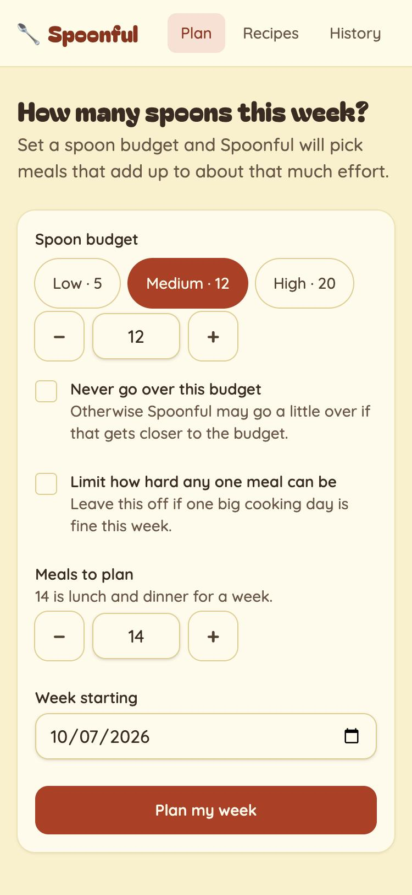
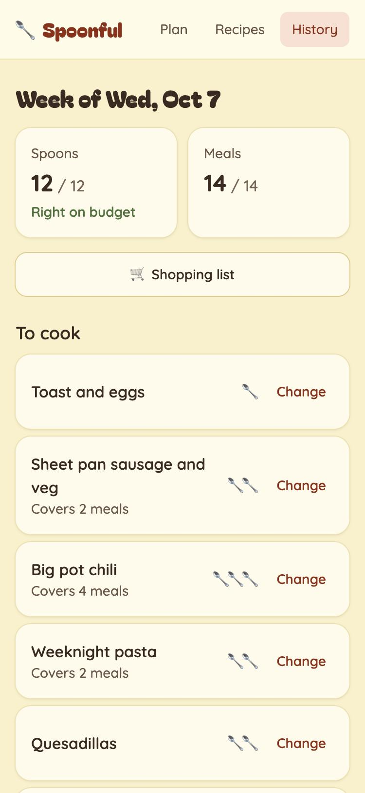
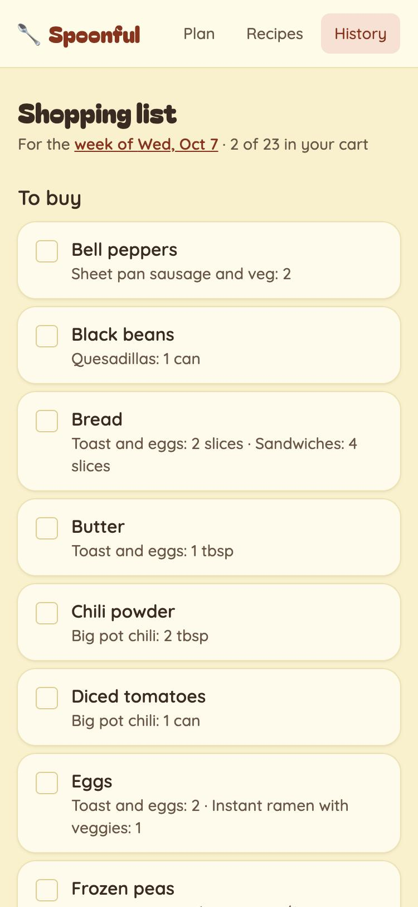
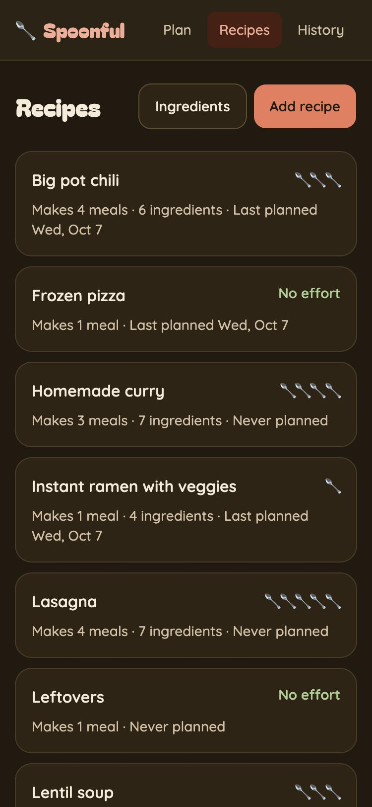

# Spoonful 🥄

A meal planner that budgets **effort** instead of money.

Spoonful is built around [spoon theory](https://en.wikipedia.org/wiki/Spoon_theory): some days you have the energy to cook something elaborate, and some days frozen pizza is the right call. You rate each recipe by how many spoons it takes to make, then ask for a week of meals that fits the energy you actually have.

**Live at [spoonful.eldev.net](https://spoonful.eldev.net)**

<p align="center">
  
  
  
  
</p>

### Try the demo

Sign in with the shared demo account to look around without signing up:

- **Email:** `demo@example.com`
- **Password:** `spoonful-demo`

Other visitors use the same account, and it resets to the sample recipes every night.

## Features

- **Recipes with a spoon rating** from 0 to 5. Zero-spoon "meals" like takeout, leftovers, or frozen pizza are recipes too.
- **Meal plans built around a spoon budget.** Pick how many meals to plan (7 by default: dinner for a week) and how many spoons you have to spend.
  - The budget is a target by default, or turn it into a hard ceiling.
  - Optionally cap how hard any single meal can be.
  - Big-batch recipes can cover several meals, and you only spend their spoons once.
  - Recipes you haven't made recently are more likely to be picked, so the plan doesn't get stale.
- **Shopping lists** for each plan, combining ingredients across recipes. Checkmarks are saved to your account, so you can build the list on your laptop and tick things off on your phone at the store.
- **An ingredient catalog** that suggests names as you type, asks "did you mean…?" for near-duplicates, and lets you merge, rename, or delete ingredients.
- **Accounts** with sign-up, sign-in, and password reset by email. Each person's recipes and plans are private to them.
- **Mobile-first**, with light and dark themes.

## Tech stack

- [Rails 8.1](https://rubyonrails.org) on Ruby 4.0
- [Inertia.js](https://inertiajs.com) + React 19 + TypeScript, bundled with [Vite](https://vite.dev) via `vite_ruby`
- [Tailwind CSS v4](https://tailwindcss.com)
- SQLite in development, Postgres in production
- Deployed on Heroku, with email through [Resend](https://resend.com)

## Running locally

You'll need Ruby 4.0.3 (see `.ruby-version`) and Node 22.

```bash
bundle install
npm install
bin/rails db:prepare
bin/rails db:seed   # optional: the demo account above, with sample recipes
bin/dev
```

Then open http://localhost:3000. `bin/dev` runs Rails and the Vite dev server together.

In development, emails (like password resets) aren't actually sent. You can read them at http://localhost:3000/letter_opener.

## Tests

```bash
bin/rails test   # Ruby: models, controllers, and data isolation between accounts
npm test         # Vitest: frontend helpers like ingredient matching
npm run check    # TypeScript type-check
```

## Deploying

Production runs on a single Heroku dyno with Heroku Postgres. The `Procfile` starts Puma and runs migrations on each release.

1. Use the `heroku/nodejs` and `heroku/ruby` buildpacks, in that order, so Vite can build the frontend during `assets:precompile`.
2. Add a Postgres add-on, which provides `DATABASE_URL`.
3. Set these config vars:

   | Variable | Purpose |
   |---|---|
   | `SECRET_KEY_BASE` | Rails secret (any long random string) |
   | `APP_HOST` | Hostname used in links inside emails, e.g. `spoonful.example.com` |
   | `MAILER_FROM` | Sender address, e.g. `Spoonful <no-reply@example.com>` |
   | `SMTP_ADDRESS`, `SMTP_PORT`, `SMTP_USERNAME`, `SMTP_PASSWORD` | Outgoing mail server |

4. `git push heroku main`
5. Optional: run `bin/rails demo:reset` to create the demo account, and schedule it daily (for example with Heroku Scheduler) to undo visitors' changes.

## Roadmap

- Structured ingredient amounts (number + unit) so the shopping list can add up totals
- Households that share recipes and plans
